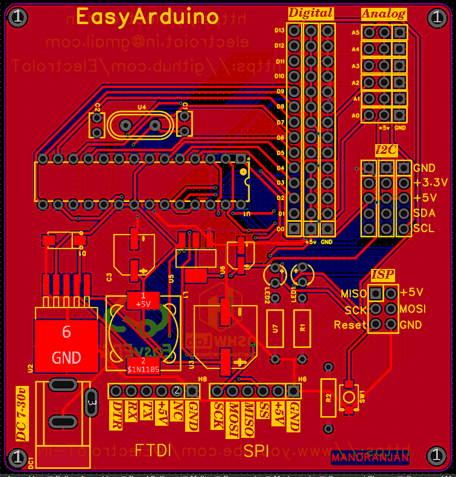
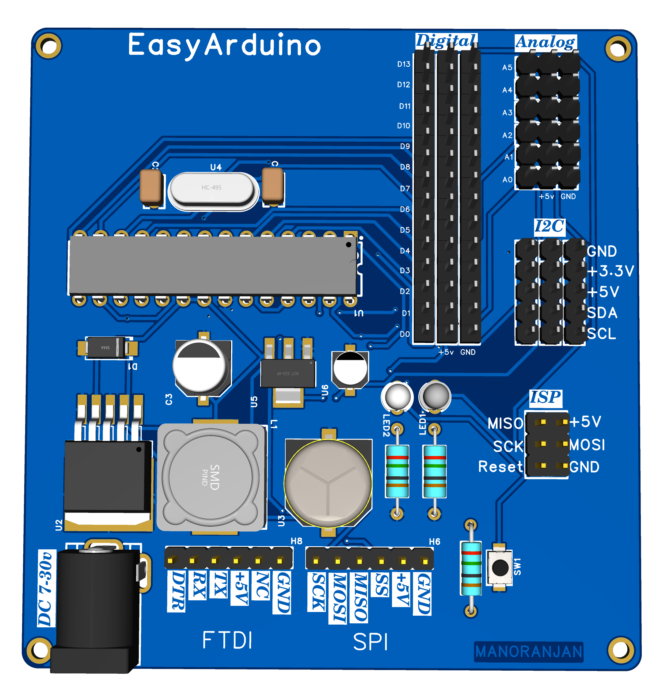
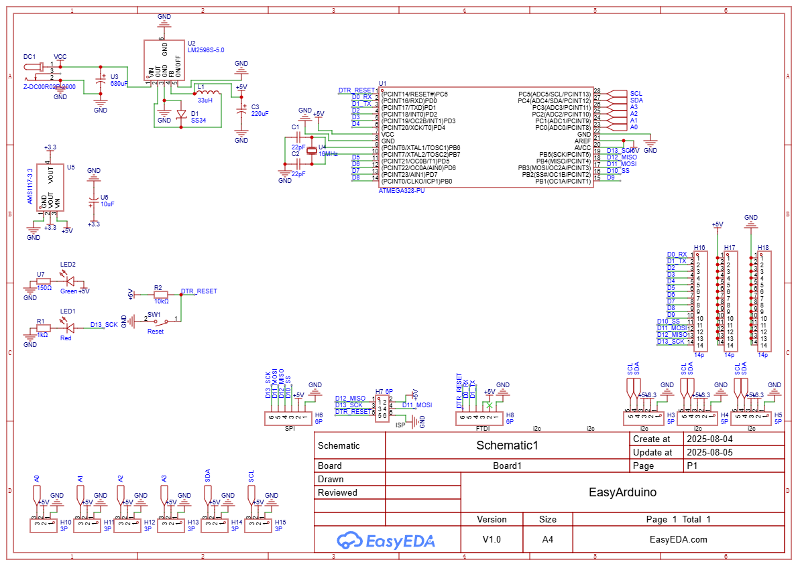

<!-- Banner/logo section -->
<p align="center">
  
</p>
<h1 align="center">EasyArduino by ElectroIoT</h1>

# The ultimate beginner’s board to learn, build, and master Arduino the easy way.


> A beginner-focused custom Arduino Uno-compatible board designed for **learning**, **soldering practice**, and **sensor experimentation**.

[](LICENSE)
[](https://www.arduino.cc/)
[](https://easyeda.com/)

---

## 🎯 Features

- ✅ ATmega328P-PU DIP – Arduino Uno compatible
- 🔌 FTDI 6-pin header for USB upload
- 🧠 ISP header for bootloader and SPI programming
- 📶 5x I²C headers with VCC, GND, SDA, SCL
- 🖲️ All digital (D2–D13) and analog (A0–A5) pins exposed with GND & 5V
- ⚡ Power input via DC jack (7–30V) and onboard voltage regulators:
  - LM2985-5.0 → 5V
  - AMS1117-3.3 → 3.3V for sensors/ESP
- 🧪 Test/learning-friendly layout with silkscreen labels
- 🔘 Onboard RESET button, Power LED, and D13 LED

---

## 🧩 Pinout Overview

### 🔌 Digital Pins (D2–D13)
- All 3-pin headers: `[GND | Dn | 5V]`
- PWM: D3, D5, D6, D9, D10, D11
- SPI: D10 (SS), D11 (MOSI), D12 (MISO), D13 (SCK)

### 📈 Analog Pins (A0–A5)
- Also usable as digital (D14–D19)

### 📡 I²C (5x Headers)
```
GND | +3.3V | +5V | SDA | SCL
```

### ⚙️ UART & FTDI Header (6-pin)
```
DTR | TX | RX | +5V | GND | NC
```

### 🛠 ISP Header (2×3)
```
MISO | VCC
SCK  | MOSI
RST  | GND
```

---


---

## 🛠 Getting Started

### 🔧 Uploading Code
1. Connect an **FTDI module** to the 6-pin FTDI header
2. In **Arduino IDE**:
   - Select Board: `Arduino Uno`
   - Choose correct COM port
   - Upload your sketch!

### 🔌 Powering the Board
- Use **DC Barrel Jack** (7–30V)
- 5V & 3.3V rails automatically regulated onboard

### 🔍 I²C Sensor Example
Plug sensor into any I²C header and use code like:

```cpp
#include <Wire.h>

void setup() {
  Wire.begin(); // I2C init
  Serial.begin(9600);
}

void loop() {
  Wire.beginTransmission(0x76); // Example address
  Wire.write(0xF4); // Example command
  Wire.endTransmission();
  delay(1000);
}
```

---

## 📸 Gallery

| 3D PCB View | Top Layout | Schematic |
|-------------|------------|-----------|
|  |  |  |

---

## 🧠 Educational Ideas
- Solder-it-yourself Arduino kit
- I²C sensor lab: OLED, BME280, RTC
- Learn SPI, I2C, UART, PWM
- Expand with ESP8266 via UART/I²C

---

## 📄 License

MIT License – use it freely for education, learning, or hacking!

---

## 🤝 Credits

Designed with 💙 in [EasyEDA](https://easyeda.com/) by **Manoranjan**
